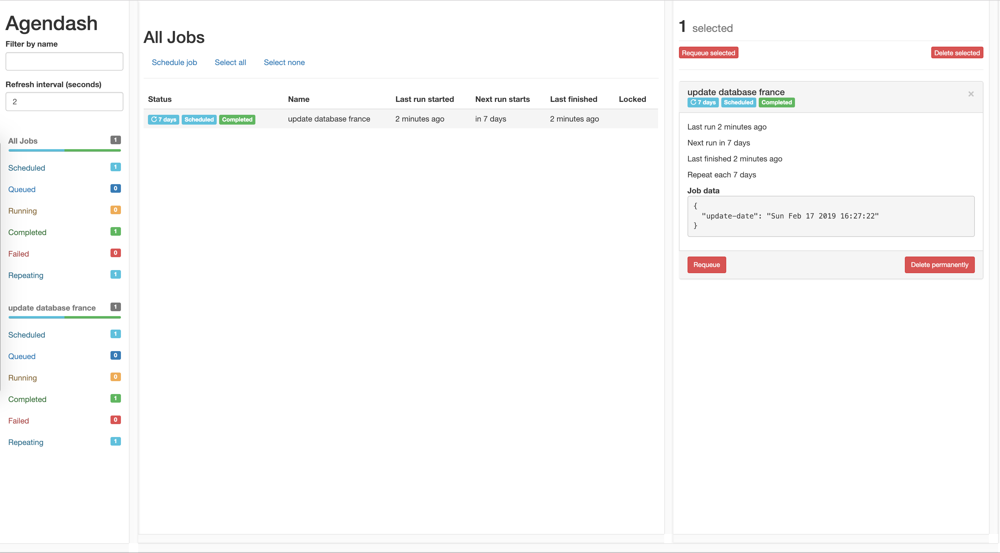

# Castle Scrapper
> Scrapper script to update the database

This tool allow creating _JSON_ item for each hotel of one destination chosen on [Relais & Chateaux](http://relaischateaux.com/).

This script use [Puppeteer](https://github.com/GoogleChrome/puppeteer) in order to scrap all one the pages.   
[Agenda](https://github.com/agenda/agenda) for job scheduling the scrapping script.
[Firebase](https://firebase.google.com/) for database management.

This project is a micro-service of _Castle_ project including [castle-client](https://github.com/quelhasu/castle-client) and [castle-api](https://github.com/quelhasu/castle-api).


## How to use it 
- [Docker Usage](#docker)
- [Hotel JSON format](#format)
- [Cron Job](#cron-job)

### <a id="docker"></a> Docker Usage

The project is executed from Docker in order to use the schedules execution correctly.

First, build the Dockerfile and pull MongoDB container:

```bash
$ docker build -t castle-cron-job .
$ docker pull mongo
```

You can now launch the `docker-composer.yml` file and access the dashboard **Agendash** on port **3022** of your logical interface.

```bash
$ docker-compose up
```

### <a id="format"></a> Hotel JSON format

#### Elements
| Property                                                                          	| Type          	| Description                                                 	|
|-----------------------------------------------------------------------------------	|---------------	|-------------------------------------------------------------	|
| disponibilites > [first,second] > body                                            	| Array<String> 	| List of price for each days `day - price - available(bool)` 	|
| disponibilites > [first,second] > name                                            	| String        	| Month and year of body Array                                	|
| from_price                                                                        	| String        	| Hotel's from price                                          	|
| id                                                                                	| String        	| Hotel's generated ID with ID function                       	|
| link                                                                              	| String        	| Hotel's Relais & Chateaux url                               	|
| location > address > {countryAddress, localityAddress, postalCode, streetAddress} 	| Object        	| Hotel's location information                                	|
| location > center > {Lat, Lng}                                                    	| Object        	| Hotel's geolocation                                         	|
| media                                                                             	| String        	| Hotel's image preview                                       	|
| name                                                                              	| String        	| Hotel's name                                                	|
| rating > {number, value}                                                          	| Object        	| Number and value of Tripadvisor ratings                     	|
| restaurant > link                                                                 	| String        	| Hotel restaurant's url                                      	|
| restaurant > michelin_rating                                                      	| String        	| Hotel restaurant's michelin rating                          	|
| restaurant > michelin_url                                                         	| String        	| Restaurant's michelin url                                   	|
| restaurant > name                                                                 	| String        	| Hotel restaurant's name                                     	|
| restaurant > services                                                             	| String        	| Restaurant menu prices                                      	|
| rooms                                                                             	| String        	| Hotel's number of rooms                                     	|
| services                                                                          	| Array<String> 	| Hotel's services available                                  	|

#### Example
```json
{
  "disponibilites": {
    "first": {
      "body": [
        "14 - 157 € - true",
        "15 - 157 € - true",
        "16 - 210 € - true",
      ],
      "name": "février 2019"
    },
    "second": {
      "body": [
        "24 - 130 € - true",
        "25 - 130 € - true",
        "26 - 130 € - true",
        "27 - 130 € - true",
        "28 - 130 € - true",
        "29 - 145 € - true",
        "30 - 145 € - true",
        "31 - 130 € - true"
      ],
      "name": "mars 2019"
    }
  },
  "from_price": "72,50",
  "id": "ebf181292",
  "link": "https://www.relaischateaux.com/fr/france/annedebretagne-loire-atlantique-la-plaine-sur-mer",
  "location": {
    "address": {
      "countryAddress": "Loire-Atlantique",
      "localityAddress": "La Plaine sur Mer",
      "postalCode": "44770,",
      "streetAddress": "163, boulevard de la Tara\nPort de la Gravette"
    },
    "center": {
      "Lat": "47.1541",
      "Lng": "-2.2144"
    }
  },
  "media": "https://media.relaischateaux.com/public/hash/34075dd2a01a31e71a79c5e8dd8fc16ac54fc5a8",
  "name": "Anne de Bretagne (Loire-Atlantique)",
  "rating": {
    "number": "314",
    "value": "9"
  },
  "restaurant": {
    "link": "https://www.relaischateaux.com/fr/france/restaurant/anne-de-bretagne-loire-atlantique-la-plaine-sur-mer",
    "michelin_rating": "2",
    "michelin_url": "https://restaurant.michelin.fr/2ciults/anne-de-bretagne-la-plaine-sur-mer",
    "name": "Anne de Bretagne",
    "services": "Menus 39-155 EUR s.c. - Carte 45-55 EUR s.c."
  },
  "rooms": "20 CHAMBRES",
  "services": [
    "Internet",
    "Piscine intérieure ou extérieure",
    "Tennis",
    "Enfants bienvenus",
    "Canoë/Kayak"
  ]
}
```

### <a id="cron-job"></a> Cron Job

The scrapping script is launched once a week thank to **Agenda** tool in order to update the database and to be able to offer a selection of the hotels of the week at the best price.

**Agenda** is accompanied by another library: **Agendash** to visualize the progress of the process and its status.


